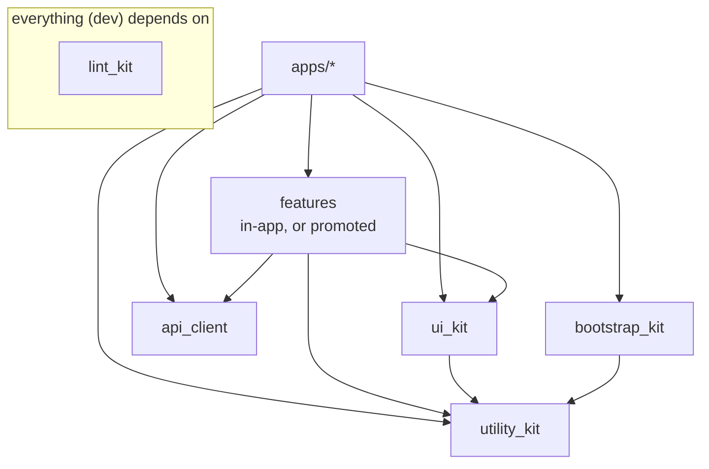

# Architecture Overview

> 🇹🇷 Türkçe için: [overview.tr.md](overview.tr.md)

## Goals

- **Modular** — features and shared concerns live in independent packages that can be built, tested, and reasoned about in isolation.
- **Testable** — business logic is pure Dart with no Flutter/IO dependencies, hidden behind interfaces (ports).
- **Consistent** — every package follows the same layout and the same tech stack, so any engineer can navigate any package.
- **Automatable** — Conventional Commits + Melos drive versioning and changelogs; a single lint config governs the whole repo.

## Principles

### 1. Clean Architecture + Hexagonal (ports & adapters)

Code is organised into three layers with a strict **dependency rule**: dependencies point *inward*, never outward.

```
presentation  ──▶  application  ──▶  domain
     (UI)          (state / use-cases)   (pure business core)
```

- **domain** — pure Dart. Entities/models (`freezed`), repository contracts, business rules, and **ports** (interfaces to the outside world). Depends on nothing Flutter-specific.
- **application** — orchestrates use-cases and holds UI-facing state (`bloc`/`cubit`). Depends on `domain` only.
- **presentation** — widgets, pages, routers, validators. Depends on `application` + `domain`.

The concrete implementations of ports and repositories (HTTP clients, storage, push, mocks) are **adapters** wired in at the app's composition root — see [Dependency direction](#dependency-direction). This is the hexagonal "ports & adapters" idea: the core defines *what* it needs; the outer app supplies *how*.

### 2. Feature-first app shell

The app is a thin **composition root**. It wires dependencies and hosts feature entry points; heavy logic lives in each feature's `domain`/`application` layers — whether those sit inside the app or in their own package.

### 3. Atomic Design for UI

The shared `ui_kit` is organised as `atoms → molecules → organisms → templates`, plus cross-cutting `core / constant / extensions`.

## Monorepo layout

```
fatiharge-apps/
├─ apps/                     # runnable applications (thin composition roots)
│  └─ wallet/lib/            # config, route, theme, infrastructure, features/
├─ packages/                 # shared packages (Melos workspace members)
│  ├─ lint_kit/              # shared analyzer + lint config (very_good_analysis)
│  ├─ utility_kit/           # UI-independent base contracts (EffectBloc)
│  ├─ bootstrap_kit/         # app startup orchestration (jobs, cubit, page)
│  └─ …                      # ui_kit, api_client, shared features — see below
├─ architecture/             # these docs
└─ .githooks/ .github/       # governance (commit hook, CI)
```

`ui_kit` and `api_client` are part of the intended shape but do not exist yet.
They are named here so the target is clear — not to imply they are available.

### Where a feature lives

A feature starts as a folder **inside the app**
(`apps/<app>/lib/features/<name>/`), carrying the same
`domain / application / presentation` layering described below. It moves out to
`packages/<name>/` only once a second app or feature actually needs it — the
test is in [package-conventions.md](package-conventions.md#when-to-create-a-new-package),
and "one consumer" does not pass it.

What makes that move cheap later is the layering, not the location: as long as
`domain/` imports nothing from Flutter, storage or IO, promoting a feature to a
package is a file move plus an import rewrite.

### Package taxonomy

| Kind        | Examples                                   | Contains layers?                         |
| ----------- | ------------------------------------------ | ---------------------------------------- |
| **kit**     | `ui_kit`, `utility_kit`, `lint_kit`        | No — cross-cutting building blocks       |
| **generated** | `api_client`                             | No — code-generated, do not hand-edit    |
| **feature** | `apps/<app>/lib/features/<name>/`, promoted to `packages/<name>/` once shared | Yes — `domain / application / presentation` |
| **app**     | `apps/<app>`                               | Composition root + `features/` shell     |

## Dependency direction

Allowed dependency edges (an arrow means "may depend on"):



Rules:

- **domain** layers depend on nothing outside their package (except `utility_kit` pure helpers and pure packages).
- **A feature starts inside the app** and only becomes a package once a second consumer exists. The layering is identical either way.
- **Features never depend on other features.** Shared code goes to a kit; cross-feature flows are coordinated by the app.
- **The app is the only place that knows concrete adapters.** It implements ports/repositories (`infrastructure/`) and registers them via DI.
- **No cycles.** Melos/pub will refuse a dependency cycle; the layering above prevents them by design.

## Tech stack (standard)

| Concern            | Choice                                    |
| ------------------ | ----------------------------------------- |
| State management   | `flutter_bloc` (cubit / bloc)             |
| Dependency injection | `get_it` + `injectable`                 |
| Routing            | `auto_route` (per-feature routers, aggregated in the app) |
| Models / unions    | `freezed` (+ `freezed_annotation`)        |
| Localization       | `easy_localization` (+ generated locale keys) |
| Assets             | `flutter_gen`                             |
| Flavors            | `flutter_flavorizr`                       |
| API client         | generated OpenAPI (`api_client`)          |
| Networking         | `http` behind an interceptor client       |
| Lint               | `very_good_analysis` via `lint_kit`       |
| Crash / messaging  | Firebase (`core`, `crashlytics`, `messaging`) |

## Code generation

Generated files are **committed** but never hand-edited, and are excluded from analysis (see `lint_kit`):

| Generator             | Output pattern        |
| --------------------- | --------------------- |
| `freezed`             | `*.freezed.dart`      |
| `json_serializable`   | `*.g.dart`            |
| `auto_route_generator`| `*.gr.dart`           |
| `injectable_generator`| `*.config.dart`       |
| `flutter_gen`         | `**/generated/**`     |

Run generation with `dart run build_runner build --delete-conflicting-outputs` in the relevant package.

---

See **[package-conventions.md](package-conventions.md)** for the concrete folder layout of each package kind.
