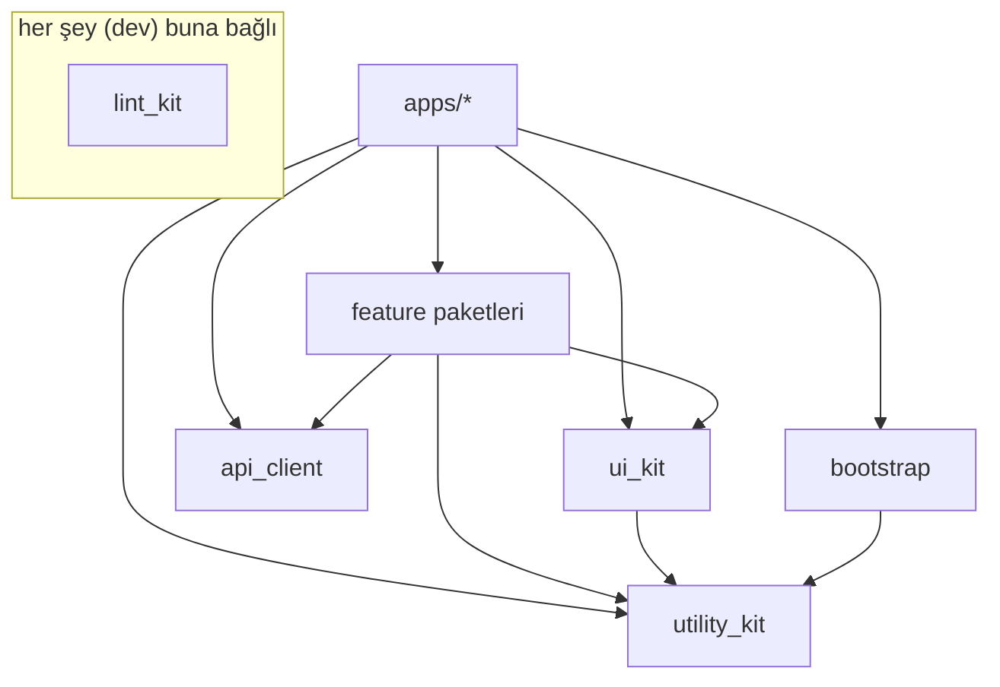

# Mimari Genel Bakış

> 🇬🇧 For English: [overview.md](overview.md)

## Hedefler

- **Modüler** — özellikler ve ortak sorumluluklar; izole biçimde derlenebilen, test edilebilen ve akıl yürütülebilen bağımsız paketlerde yaşar.
- **Test edilebilir** — iş mantığı, Flutter/IO bağımlılığı olmayan saf Dart'tır ve arayüzlerin (port'ların) arkasına gizlenir.
- **Tutarlı** — her paket aynı yerleşimi ve aynı tech stack'i izler; böylece herhangi bir geliştirici herhangi bir pakette gezinebilir.
- **Otomatikleştirilebilir** — Conventional Commits + Melos versiyonlama ve changelog'u besler; tek bir lint config tüm repoyu yönetir.

## İlkeler

### 1. Clean Architecture + Hexagonal (ports & adapters)

Kod, katı bir **bağımlılık kuralı** ile üç katmana ayrılır: bağımlılıklar *içeriye* bakar, asla dışarıya değil.

```
presentation  ──▶  application  ──▶  domain
     (UI)          (state / use-case)   (saf iş çekirdeği)
```

- **domain** — saf Dart. Varlıklar/modeller (`freezed`), repository sözleşmeleri, iş kuralları ve dış dünyaya açılan **port'lar** (arayüzler). Flutter'a özgü hiçbir şeye bağlı değildir.
- **application** — use-case'leri düzenler ve UI'a bakan state'i (`bloc`/`cubit`) tutar. Yalnızca `domain`'e bağlıdır.
- **presentation** — widget'lar, sayfalar, router'lar, validator'lar. `application` + `domain`'e bağlıdır.

Port'ların ve repository'lerin somut implementasyonları (HTTP client, storage, push, mock'lar) **adapter**'lardır ve uygulamanın composition root'unda bağlanır — bkz. [Bağımlılık yönü](#bağımlılık-yönü). Hexagonal "ports & adapters" fikri budur: çekirdek *neye* ihtiyaç duyduğunu tanımlar; dıştaki uygulama *nasıl* sağlanacağını verir.

### 2. Feature-first uygulama kabuğu

Uygulama ince bir **composition root**'tur. Bağımlılıkları bağlar ve feature giriş noktalarını barındırır; ağır mantık feature/domain paketlerinde yaşar.

### 3. UI'da Atomic Design

Paylaşılan `ui_kit`; `atoms → molecules → organisms → templates` ve enine kesen `core / constant / extensions` olarak düzenlenir.

## Monorepo yerleşimi

```
fatiharge-apps/
├─ apps/                     # çalıştırılabilir uygulamalar (ince composition root'lar)
│  └─ <app>/lib/app/…
├─ packages/                 # paylaşılan & feature paketleri (Melos workspace member)
│  ├─ lint_kit/              # ortak analyzer + lint config (very_good_analysis)
│  ├─ utility_kit/           # extension, base tipler, servisler, storage, exception
│  ├─ ui_kit/                # tasarım sistemi (Atomic Design) + theme
│  ├─ api_client/            # generated OpenAPI client
│  ├─ bootstrap/             # uygulama başlangıç orkestrasyonu (job, cubit, page)
│  └─ <feature>/             # örn. auth, content_engine, dynamic_form
├─ architecture/             # bu dokümanlar
└─ .githooks/ .github/       # governance (commit hook, CI)
```

### Paket taksonomisi

| Tür         | Örnekler                                   | Katman içerir mi?                        |
| ----------- | ------------------------------------------ | ---------------------------------------- |
| **kit**     | `ui_kit`, `utility_kit`, `lint_kit`        | Hayır — enine kesen yapı taşları         |
| **generated** | `api_client`                             | Hayır — kod üretimi, elle düzenlenmez    |
| **feature** | `auth`, `content_engine`, `dynamic_form`   | Evet — `domain / application / presentation` |
| **app**     | `apps/<app>`                               | Composition root + `features/` kabuğu    |

## Bağımlılık yönü

İzin verilen bağımlılık kenarları (ok "bağımlı olabilir" demek):



Kurallar:

- **domain** katmanları kendi paketleri dışında hiçbir şeye bağlı değildir (`utility_kit` saf yardımcıları ve saf paketler hariç).
- **Feature'lar başka feature'lara bağlanmaz.** Ortak kod bir kit'e taşınır; feature'lar arası akışları uygulama koordine eder.
- **Somut adapter'ları yalnızca uygulama bilir.** Port/repository'leri (`infrastructure/`) uygulama implemente eder ve DI ile kaydeder.
- **Döngü yok.** Melos/pub bir bağımlılık döngüsünü reddeder; yukarıdaki katmanlama bunu tasarımca engeller.

## Tech stack (standart)

| Konu               | Seçim                                     |
| ------------------ | ----------------------------------------- |
| State yönetimi     | `flutter_bloc` (cubit / bloc)             |
| Dependency injection | `get_it` + `injectable`                 |
| Routing            | `auto_route` (feature başına router, uygulamada birleştirilir) |
| Model / union      | `freezed` (+ `freezed_annotation`)        |
| Lokalizasyon       | `easy_localization` (+ generated locale key) |
| Asset'ler          | `flutter_gen`                             |
| Flavor             | `flutter_flavorizr`                       |
| API client         | generated OpenAPI (`api_client`)          |
| Networking         | interceptor client arkasında `http`       |
| Lint               | `lint_kit` üzerinden `very_good_analysis` |
| Crash / messaging  | Firebase (`core`, `crashlytics`, `messaging`) |

## Kod üretimi

Üretilen dosyalar **commit edilir** ama asla elle düzenlenmez ve analizden hariç tutulur (bkz. `lint_kit`):

| Generator             | Çıktı deseni          |
| --------------------- | --------------------- |
| `freezed`             | `*.freezed.dart`      |
| `json_serializable`   | `*.g.dart`            |
| `auto_route_generator`| `*.gr.dart`           |
| `injectable_generator`| `*.config.dart`       |
| `flutter_gen`         | `**/generated/**`     |

Üretimi ilgili pakette `dart run build_runner build --delete-conflicting-outputs` ile çalıştır.

---

Her paket türünün somut klasör yerleşimi için bkz. **[package-conventions.tr.md](package-conventions.tr.md)**.
